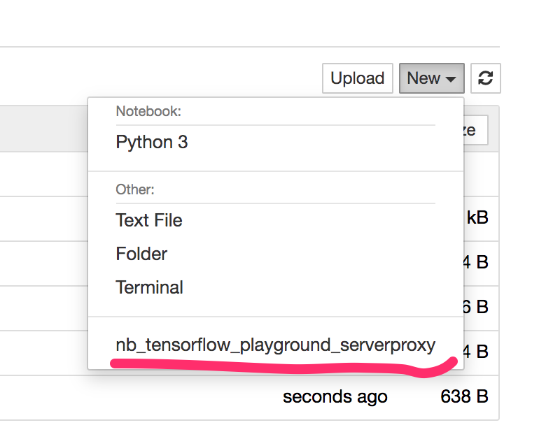

# nb\_tensorflow\_playground\_serverproxy
Jupyter server proxy wrapper for local [Tensorflow Playground](https://github.com/tensorflow/playground) application

The extension maps the [original *Tensorflow Playground* code](https://github.com/tensorflow/playground) with a simplified HTML page inside a simple Pyhton http server.

